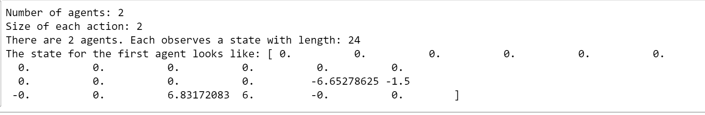
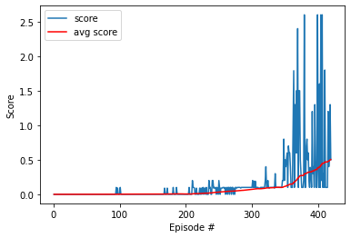

# Project 3: Collaboration Competition

## Environment to be solved

The task is episodic, and in order to solve the environment, your agents must get an average score of +0.5 (over 100 consecutive episodes, after taking the maximum over both agents). Specifically,

- After each episode, we add up the rewards that each agent received (without discounting), to get a score for each agent. This yields 2 (potentially different) scores. We then take the maximum of these 2 scores.
- This yields a **single score** for each episode.

The environment is considered solved, when the average (over 100 episodes) of those scores is at least **+0.5.**

##### &nbsp;

## Approach
##### &nbsp;

### 1. Evaluate State & Action Space

The observation space consists of 8 variables corresponding to the position and velocity of the ball and racket. Each agent receives its own, local observation. Two continuous actions are available, corresponding to movement toward (or away from) the net, and jumping.

```Python
# reset the environment
env_info = env.reset(train_mode=True)[brain_name]

# number of agents
num_agents = len(env_info.agents)
print('Number of agents:', num_agents)

# size of each action
action_size = brain.vector_action_space_size
print('Size of each action:', action_size)

# examine the state space
states = env_info.vector_observations
state_size = states.shape[1]
print('There are {} agents. Each observes a state with length: {}'.format(states.shape[0], state_size))
print('The state for the first agent looks like:', states[0])
```


##### &nbsp;

### 2. Establish Baseline
Before building an agent that learns, I started by testing the agents that selects actions (uniformly) at random at each time step.

```python
for i in range(1, 6):                                      # play game for 5 episodes
    env_info = env.reset(train_mode=False)[brain_name]     # reset the environment    
    states = env_info.vector_observations                  # get the current state (for each agent)
    scores = np.zeros(num_agents)                          # initialize the score (for each agent)
    while True:
        actions = np.random.randn(num_agents, action_size) # select an action (for each agent)
        actions = np.clip(actions, -1, 1)                  # all actions between -1 and 1
        env_info = env.step(actions)[brain_name]           # send all actions to tne environment
        next_states = env_info.vector_observations         # get next state (for each agent)
        rewards = env_info.rewards                         # get reward (for each agent)
        dones = env_info.local_done                        # see if episode finished
        scores += env_info.rewards                         # update the score (for each agent)
        states = next_states                               # roll over states to next time step
        if np.any(dones):                                  # exit loop if episode finished
            break
    print('Score (max over agents) from episode {}: {}'.format(i, np.max(scores)))
```

##### &nbsp;

### 3. Implement Learning Algorithm

It has been implemented the ddpg algorithm to train both agents, the solution can be found in the following [paper](https://papers.nips.cc/paper/7217-multi-agent-actor-critic-for-mixed-cooperative-competitive-environments.pdf).

For more details of the ddpg model, I suggest to review the [report](https://github.com/ASO92/DRL_p2_ContinuousControl_Udacity/blob/master/Report.md#actor-critic-method) of the previous Udacity project.

#### Summary actor-critic model

The structure of the Actor consist on 3 fully connected layers. The two first layers are activated by ReLU function and last layer by tanh function:
- Fully connected layer 1 - F1 = ReLU (input: input_state (states = 24) x output: 400 neurons)
- Fully connected layer 2 - F2 = ReLU (input: F1 x output: 300 neurons)
- Fully connected layer 1 - F3 = tanh (input: F2 x output_state (actions = 2))

The structure of the Critic consist on 3 fully connected layers. The two fist layers are activated by ReLU and the last layer it is not activated:
- Fully connected layer 1 - F1 = ReLU (input_state (states = 24) x 256 neurons)
- Fully connected layer 2 - F2 = ReLU (F1+action_size (=4) x 128 neurons)
- Fully connected layer 3 - F3 = (F2 x output: 1)

Two NNs for actor and critic of same architecture are used:
local network (θ_local) and target network (θ_target).

The target network is soft updated using the local network θ_target = τθ_local + (1 - τ)θ_target.
#### Agents models details

Note the following two considerations when implementing the agents model

##### Ornstein-Uhlenbeck noise

Noise was added using an Ornstein-Uhlenbeck process (as recommended in the presented paper) theta and sigma were set as the same values as the paper 0.15 and 0.2 respectively. It was noticed that both agents struggled to learn after a considerable amount of episodes. To solve this issue the noise was removed. This made an significant improvement.

**First attept**: the Noise was stopped at `episode 300`. Number of episodes to solve the environment:`417`
**Second attemtp**: the Noise was stopped at `episode 200`. Number of episoded to solve the environment:`419`

Results can be shown in the [report](./Report.md). Both implementations have the approximate same number of episodes to be solved.

##### Weight decay

Another thing it was changed was to set the weight_decay to 0. With weight_decay the agents seemed to get stuck either at the edge of their play area. After removing the weight_decay it was noticed that both agents started to succeeded at tracking the ball correctly.

#### Summary Agents' hyperparameters

Main characteristic to highlight is that both agents share the same replay buffer. This way their experience is combined when training.

The rest of the hyperparameters are described below:

- Agent 1:
  - BUFFER_SIZE=int(1e6)
  - Memory= None
  - BATCH_SIZE=512
  - GAMMA=0.99     
  - TAU=1e-2
  - LR_ACTOR=1e-3     
  - LR_CRITIC=1e-3      
  - WEIGHT_DECAY=0
  - RANDOM_SEED=0

- Agent 2:
    - BUFFER_SIZE=int(1e6)
    - Memory = agent1.memory
    - BATCH_SIZE=512
    - GAMMA=0.99     
    - TAU=1e-2
    - LR_ACTOR=1e-3     
    - LR_CRITIC=1e-3      
    - WEIGHT_DECAY=0
    - RANDOM_SEED=0


### 4. Results obtained

In the following figure it is possible to see the results of the training. It is obtained an average of 0,5 in the last 100 episodes in the episode 419.



### 5. Ideas for Future Work

 1. Use Proximal Policy Optimization algorithm instead ddpg to train the agent.
 2. Try to implement Prioritized Experience Replay
 3. Investigate how to share more information between agents. For example the weights between neural networks.
